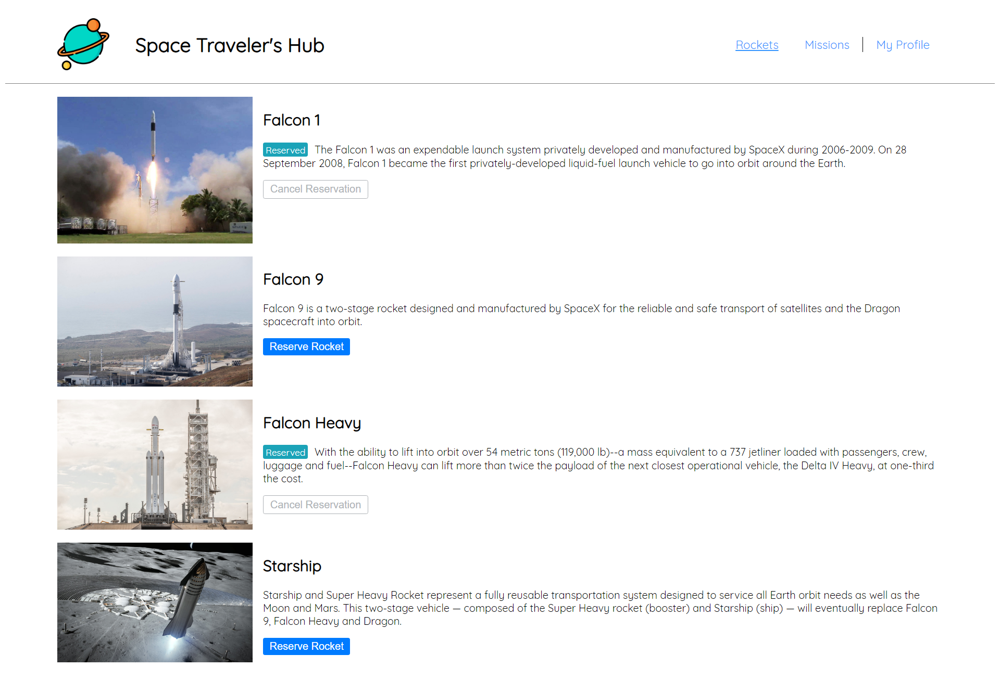
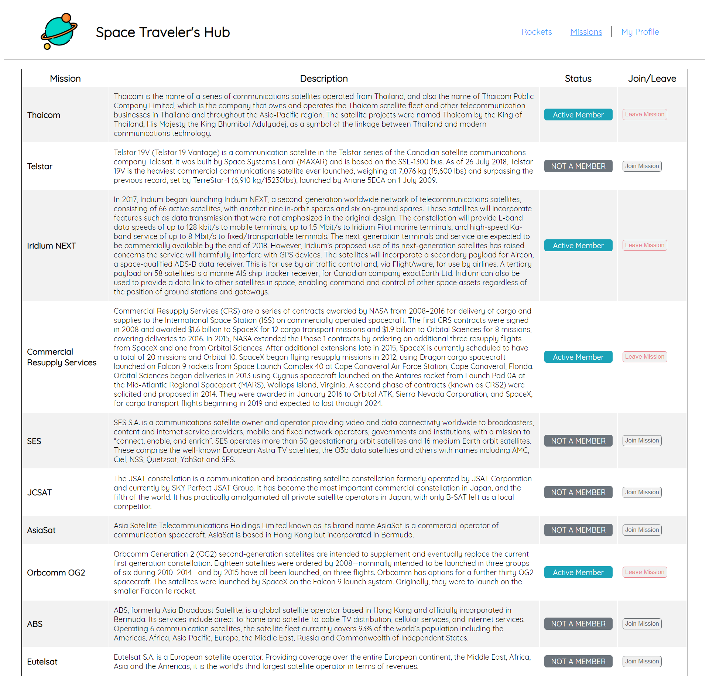
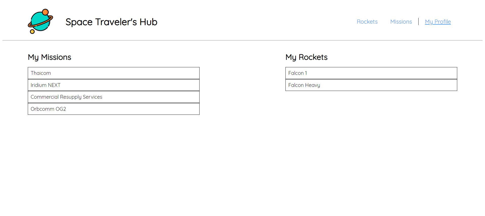

# Rockets and Missions

> The amazing ReactGroupProject project uses the real live data from the SpaceX API.
> Rockets and Missions are displayed in respective pages.
> Users can make and cancel reservations to Rockets.
> Users can join and leave Missions.
> Reserved reservations to Rockets and joined Missions are displayed in the "My Profile" page.

## Built With

- JavaScript
- React
- Redux
- React Testing Library

## Screenshots

## Getting Started

To get a local copy up and running:

1. Clone this repository or download the zip folder:

**`git clone https://github.com/HtetNaing0814/ReactGroupProject.git`**

2. Navigate to the location of the folder in your machine:

**`you@your-Pc-name:~$ cd ReactGroupProject`**

3. Open the project with VScode:

**`code .`**

4. Build the node packages:

**`npm run build`**

5. Run the server:

**`npm start`**

### Deployment

Here is the online version of [ReactGroupProject](https://xrocket.netlify.app/)

## Rex

👤 - Github: [@rex-9](https://github.com/rex-9/) 
👤 - Medium: [@rex9](https://medium.com/rex9/) 
👤 - LinkedIn: [@rex9](https://www.linkedin.com/in/rex9/) 
👤 - Facebook: [@htetnaing0814](https://www.facebook.com/htetnaing0814) 
👤 - Angelist: [@rex9](https://angel.co/u/rex9) 

## Bahoz

👤 - Github: [Bahoz Ali](https://github.com/bahoz-ali/) 
👤 - LinkedIn: [Bahoz Ali](https://www.linkedin.com/in/bahoz-ali/) 
👤 - Angelist: [Htet Naing](https://angel.co/u/bahoz-ali) 

## 🤝 Contributions

Contributions, issues, and feature requests are welcome!

Feel free to check [issue page](https://github.com/HtetNaing0814/ReactGroupProject/issues).

## Show your support

Give a ⭐️ if you like this project!

## Acknowledgments

[Microverse](https://bit.ly/MicroverseTN)

## 📝 License

This project is [MIT](./MIT.md) licensed.
